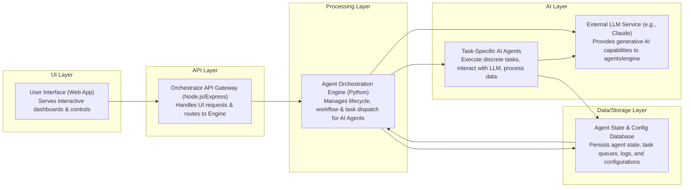

# Agent Orchestrator

## Overview
*   Provides a centralized system for managing and coordinating autonomous agents.
*   Enables the orchestration of complex workflows involving multiple AI agents.
*   Facilitates dynamic execution and interaction between different agent services.
*   Designed to automate multi-step tasks and improve operational efficiency.

## Business Problem
*   Lack of a unified platform to manage diverse AI agents and their interactions.
*   Challenges in chaining agent capabilities to achieve complex business objectives.
*   Difficulty in monitoring and controlling the execution flow of autonomous tasks.
*   Need for a flexible system to integrate new agents and adapt existing workflows.

## Key Capabilities
*   **Agent Management**: Register, configure, and manage a pool of AI agents.
*   **Workflow Orchestration**: Define and execute multi-agent workflows.
*   **Dynamic Execution**: Adapt workflow execution based on real-time conditions.
*   **API Gateway**: Expose agent capabilities through a unified API.
*   **Task Delegation**: Assign specific tasks to the most suitable agents.
*   **Result Aggregation**: Collect and synthesize outputs from multiple agents.
*   **Monitoring**: Track the status and performance of active agent orchestrations.

## Tech Stack
- Cloud:
- Backend: Node.js, Python, C#/.NET
- Frontend: JavaScript
- Data:
- AI/ML: Agent-based AI Systems

## Architecture Flow
1.  User or external system initiates an orchestration request via the Frontend or directly to a Backend API.
2.  Frontend calls the Backend API endpoint for orchestration.
3.  Backend receives the request and validates it.
4.  Backend delegates the request to the Orchestration Engine.
5.  Orchestration Engine dynamically selects and invokes relevant AI Agents based on the workflow.
6.  Invoked Agents perform their specific tasks and return results to the Orchestration Engine.
7.  Orchestration Engine aggregates results from all participating agents.
8.  Backend receives the aggregated results from the Orchestration Engine.
9.  Backend formats and returns the final response to the Frontend.
10. Frontend displays the orchestration outcome to the user.

## Repository Structure
```
.
├── data/
├── orchestration/
├── public/
├── routes/
├── views/
├── .gitignore
├── package.json
├── server.js
├── SETUP_QUICK.sh
├── START_ENDPOINTS.sh
├── START_SERVICES.sh
└── [...]
```

## Local Setup
1.  Clone the repository:
    `git clone https://github.com/ramamurthy-540835/agent-orchestrator.git`
    `cd agent-orchestrator`
2.  Install backend dependencies:
    `npm install`
3.  Execute the quick setup script:
    `./SETUP_QUICK.sh`
4.  Start all required services:
    `./START_SERVICES.sh`
5.  Start API endpoints:
    `./START_ENDPOINTS.sh`

## Deployment
1.  Ensure all local setup steps are completed and services are functional.
2.  Package the application using `agent-orchestration.zip` or similar mechanism.
3.  Transfer the packaged application to the target deployment environment.
4.  Unpack the application and install production dependencies.
5.  Configure environment variables for the deployment.
6.  Start the application services in the production environment.
7.  Validate deployment using provided test cases.
## Architecture

An Agent Orchestration Platform for Managing AI-driven Workflows.



For a standalone preview, see [docs/architecture.html](docs/architecture.html).

### Key Architectural Aspects:
* The platform provides a Node.js-based web interface and API for users to interact with the orchestration system.
* A Python-based Agent Orchestration Engine is central to managing various AI agents and their workflows.
* Task-specific AI agents perform designated operations, often leveraging external Large Language Models (LLMs) for generative capabilities.
* All agent states, task queues, and configuration data are persistently stored in a dedicated database.
